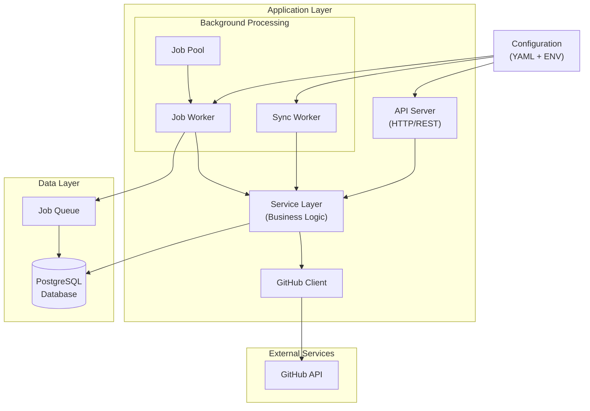

# GitHub API Data Fetching and Service

A Go service that monitors GitHub repositories, fetches commit information, and stores it in a PostgreSQL database. The service continuously syncs repository data and provides easy access to commit statistics through a RESTful API.

## Quick Start with Docker

1. Clone the repository:

```bash
git clone https://github.com/okeibunor/github-service.git
cd github-service
```

2. Set up your GitHub token:

```bash
export GITHUB_SERVICE_GITHUB_TOKEN=your_github_token_here
```

3. Start the service using Docker Compose:

```bash
docker-compose up --build
```

The service will be available at `http://localhost:8080`. The PostgreSQL database will be accessible at `localhost:5432`.

To test with the Chromium repository: `./scripts/test-chromium.sh`

## Features

- Fetches and stores repository metadata
- Continuously monitors repositories for new commits
- Stores commit information in a PostgreSQL database
- RESTful API for managing repositories and retrieving statistics
- Detailed commit analytics and author information
- Swagger/OpenAPI documentation
- Repository metadata synchronization
- Commit history tracking (fetches latest 100 commits per sync interval)
- Author statistics
- Configurable sync intervals

## Architecture

The service follows a modular, scalable architecture designed for reliability and maintainability. For detailed architecture documentation, see [docs/architecture.md](docs/architecture.md).

### System Overview



## Documentation

The `/docs` folder contains comprehensive documentation:

- `api.yaml` - OpenAPI/Swagger specification
- `commit_queries.md` - Commit-related database operations
- `repository_queries.md` - Repository management operations

## Configuration

### Environment Variables

The service can be configured using environment variables. When using Docker, these are already set in the `docker-compose.yml` file, but you can override them:

```bash
# Required
GITHUB_SERVICE_GITHUB_TOKEN=your_github_token_here  # GitHub Personal Access Token

# Optional
GITHUB_SERVICE_MONITOR_INTERVAL=1h     # Repository sync interval
GITHUB_SERVICE_LOG_LEVEL=info         # Logging level (debug, info, warn, error)
GITHUB_SERVICE_LOG_FORMAT=json        # Logging format (json, text)
```

### Custom Configuration

For advanced configuration, you can modify the `config.yaml` file. When using Docker, mount your custom configuration:

```bash
docker-compose run -v $(pwd)/custom-config.yaml:/app/config.yaml app
```

## Security Notes

- Never commit your GitHub token to version control
- Use environment variables for sensitive credentials
- Regularly rotate your GitHub token
- Use the minimum required permissions for your GitHub token
