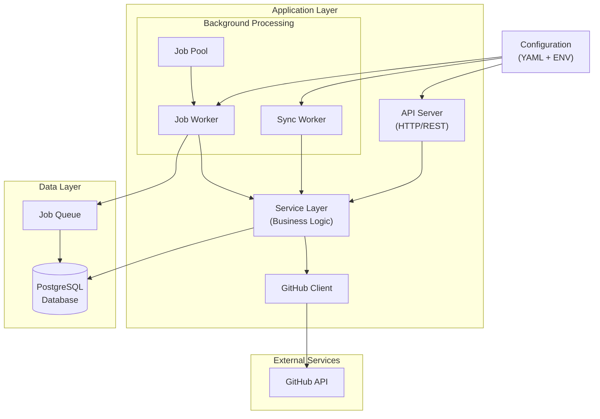

# System Architecture

## Overview

The GitHub Service is designed as a modular, scalable system for monitoring and synchronizing GitHub repositories. The architecture follows clean code principles with clear separation of concerns and dependency injection.

## Architecture Diagram

## Component Description

### Application Layer

1. **API Server**

   - Handles HTTP/REST requests
   - Provides endpoints for repository management
   - Implements rate limiting and request validation
   - Routes requests to appropriate service methods

2. **Service Layer**

   - Contains core business logic
   - Manages repository synchronization
   - Handles data consistency
   - Coordinates between different components

3. **GitHub Client**
   - Manages communication with GitHub API
   - Handles rate limiting
   - Implements retry logic
   - Fetches repository and commit data

### Background Processing

1. **Sync Worker**

   - Manages periodic repository synchronization
   - Configurable sync intervals
   - Handles repository monitoring
   - Fetches latest 100 commits per sync interval
   - Coordinates with job queue

2. **Job Worker**

   - Processes background jobs
   - Handles job retries and error recovery
   - Manages job state transitions
   - Reports job status

3. **Job Pool**
   - Manages worker concurrency
   - Distributes jobs across workers
   - Handles worker lifecycle

### Data Layer

1. **PostgreSQL Database**

   - Stores repository metadata
   - Maintains commit history
   - Tracks monitoring status
   - Provides data persistence

2. **Job Queue**
   - Manages asynchronous tasks
   - Handles job scheduling
   - Provides job status tracking
   - Ensures job reliability

## Configuration

The system is configured through:

- YAML configuration files
- Environment variables
- Command-line flags

Key configuration areas include:

- Database connection settings
- GitHub API credentials
- Sync intervals
- Worker pool sizes
- Logging settings

## Security

1. **Authentication**

   - GitHub token-based authentication
   - Database credentials management
   - API authentication (if exposed)

2. **Data Protection**
   - Secure database connections
   - Environment variable protection
   - Sensitive data encryption

## Scalability

The architecture supports horizontal scaling through:

- Independent worker processes
- Configurable worker pools
- Database connection pooling
- Job queue distribution

## Monitoring and Logging

- Structured JSON logging
- Error tracking and reporting
- Job status monitoring
- Performance metrics collection
